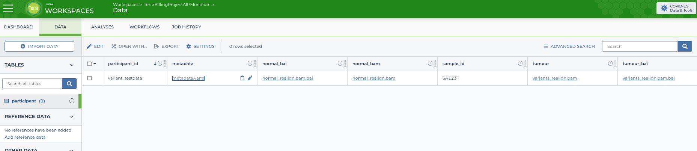

#### Upload Test Data to google storage


*Note: for this tutorial we are starting from a small test dataset that is imported and run through terra from scratch. 
In production, the normal bam will come in as input from Google Storage and the tumour bam will be the `bam` output 
from `mondrian-alignment`.*


Track down the test data from the quickstart guide [here](quickstart/haplotype_calling.md) Please download, 
extract and upload the test data Google storage


For instance:
```
wget https://mondriantestdata.s3.amazonaws.com/variant_calling_testdata.tar.gz
tar -xvf variant_calling_testdata.tar.gz
gsutil cp -r variant_testdata gs://<bucket-id>/testdata/
```


#### Setup sample in Terra Data

Go to the Data section of Terra


and click on `Import Data` and then `upload tsv`. Go to `text import Tab`


and enter the participant id
```
entity:participant_id
variant_testdata
```
and click on import

Once its imported, We'll add columns to the table to point to files we just uploaded into Google storage



Go to workflows -> Find a workflow


Add the `variant_calling.wdl` file to the Broad Methods repository and click on export


In the workflow configuration page
choose 
`Run workflow(s) with inputs defined by data table`

select `participant` as the root entity type, click on cell data and select the `variant_testdata` sample


Finish filling in the input entries as follows:

Note: We'll use the test reference data for this guide

##### Inputs:

| Field | Value |
|-------|-------|
| chromosomes | ["22"] |
| normal_bai | this.normal_bai |
| normal_bam | this.normal_bam |
| reference | {"reference":"gs://<bucket-id>/references/mondrian-ref-20-22/human/GRCh37-lite.fa", "reference_dict":"gs://<bucket-id>/references/mondrian-ref-20-22/human/GRCh37-lite.dict", "reference_fa_fai":"gs://<bucket-id>/references/mondrian-ref-20-22/human/GRCh37-lite.fa.fai", "vep_ref":"gs://<bucket-id>/references/mondrian-ref-20-22/vep.tar", "vep_fasta_suffix": "homo_sapiens/99_GRCh37/Homo_sapiens.GRCh37.75.dna.primary_assembly.fa.gz", "ncbi_build": "GRCh37", "cache_version": "99", "species":"homo_sapiens", "panel_of_normals": "gs://<bucket-id>/references/mondrian-ref-20-22/human/somatic-b37_Mutect2-WGS-panel-b37.vcf.gz", "panel_of_normals_idx": "gs://<bucket-id>/references/mondrian-ref-20-22/human/somatic-b37_Mutect2-WGS-panel-b37.vcf.gz.tbi", "variants_for_contamination": "gs://<bucket-id>/references/mondrian-ref-20-22/human/small_exac_common_3.vcf.gz", "variants_for_contamination_idx": "gs://<bucket-id>/references/mondrian-ref-20-22/human/small_exac_common_3.vcf.gz.tbi", "realignment_index_bundle": "gs://<bucket-id>/references/mondrian-ref-20-22/human/GRCh37-lite.fa.img", "gnomad": "gs://<bucket-id>/references/mondrian-ref-20-22/human/gnomad.vcf.gz", "gnomad_idx": "gs://<bucket-id>/references/mondrian-ref-20-22/human/gnomad.vcf.gz.tbi"} |
| samples | {"sample_id": this.sample_id, "tumour": this.tumour, "tumour_bai": this.tumour_bai, "metadata_input": this.metadata} |
| docker_image | quay.io/mondrianscwgs/variant_calling:v0.0.71 |


##### Outputs:

| Field | Value |
|-------|-------|
| finalmaf | this.variants_final_maf|
| finalvcf | this.variants_final_vcf|
| finalvcf_csi | this.variants_final_vcf_csi|
| finalvcf_tbi | this.variants_final_vcf_tbi|
| metadata_output | this.variants_metadata |
| sample_maf | this.variants_sample_maf|
| sample_museq_vcf | this.variants_sample_museq_vcf |
| sample_museq_vcf_csi | this.variants_sample_museq_vcf_csi|
| sample_museq_vcf_tbi | this.variants_sample_museq_vcf_tbi|
| sample_mutect_vcf | this.variants_sample_mutect_vcf |
| sample_mutect_vcf_csi | this.variants_sample_mutect_vcf_csi|
| sample_mutect_vcf_tbi | this.variants_sample_mutect_vcf_tbi|
| sample_strelka_vcf | this.variants_sample_strelka_vcf |
| sample_strelka_vcf_csi | this.variants_sample_strelka_vcf_csi|
| sample_strelka_vcf_tbi | this.variants_sample_strelka_vcf_tbi|
| sample_strelka_snv_vcf | this.variants_sample_strelka_snv_vcf |
| sample_strelka_snv_vcf_csi | this.variants_sample_strelka_snv_vcf_csi|
| sample_strelka_snv_vcf_tbi | this.variants_sample_strelka_snv_vcf_tbi|
| sample_strelka_indel_vcf | this.variants_sample_strelka_indel_vcf |
| sample_strelka_indel_vcf_csi | this.variants_sample_strelka_indel_vcf_csi|
| sample_strelka_indel_vcf_tbi | this.variants_sample_strelka_indel_vcf_tbi|
| sample_vcf | this.variants_sample_vcf |
| sample_vcf_csi | this.variants_sample_vcf_csi |
| sample_vcf_tbi | this.variants_sample_vcf_tbi |


Save and then run analysis. 